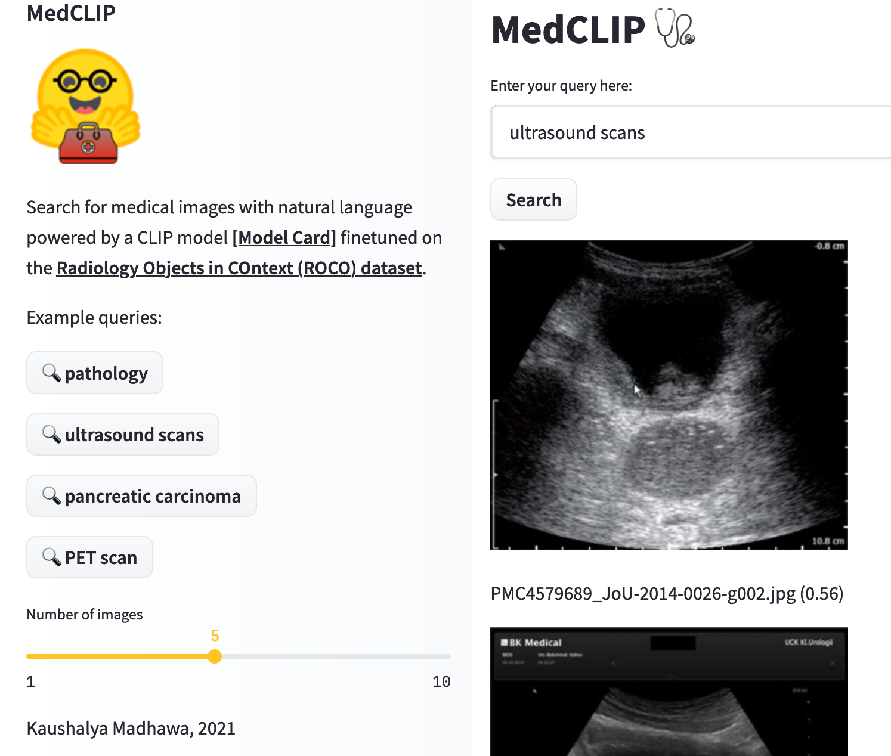
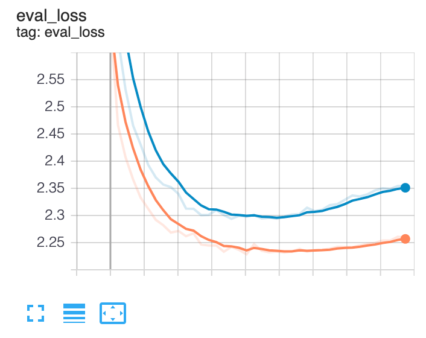

# MedCLIP: Fine-tuning a CLIP model on the ROCO medical dataset

<!--  -->
<h3 align="center">
  <!-- <p>MedCLIP</p> -->
  

## Summary
This repository contains the code for fine-tuning a CLIP model [[Arxiv paper](https://arxiv.org/abs/2103.00020)][[OpenAI Github Repo](https://github.com/openai/CLIP)] on the [ROCO dataset](https://github.com/razorx89/roco-dataset), a dataset made of radiology images and a caption.
This work is done as a part of the [**Flax/Jax community week**](https://github.com/huggingface/transformers/blob/master/examples/research_projects/jax-projects/README.md#quickstart-flax-and-jax-in-transformers) organized by Hugging Face and Google.

### Demo
You can try a Streamlit demo app that uses this model on [🤗 Spaces](https://huggingface.co/spaces/kaushalya/medclip-roco). You may have to signup for 🤗 Spaces private beta to access this app (screenshot shown below).


🤗 Hub Model card: https://huggingface.co/flax-community/medclip-roco
## Dataset 🧩

Each image is accompanied by a textual caption. The caption length varies from a few characters (a single word) to 2,000 characters (multiple sentences). During preprocessing we remove all images that has a caption shorter than 10 characters.
Training set: 57,780 images with their caption.
Validation set: 7,200
Test set: 7,650

[ ] Give an example

## Installation 💽
This repo depends on the master branch of [Hugging Face - Transformers library](https://github.com/huggingface/transformers). First you need to clone the transformers repository and then install it locally (preferably inside a virtual environment) with `pip install -e ".[flax]"`.

## The Model ⚙️
You can load the pretrained model from the Hugging Face Hub with
```
from medclip.modeling_hybrid_clip import FlaxHybridCLIP

model = FlaxHybridCLIP.from_pretrained("flax-community/medclip-roco")
```
## Training
The model is trained using Flax/JAX on a cloud TPU-v3-8. 
You can fine-tune a CLIP model implemented in Flax by simply running `sh run_medclip`.
This is the validation loss curve we observed when we trained the model using the `run_medclip.sh` script.


## Limitations 🚨
The current model is capable of identifying if a given radiology image is a PET scan or an ultrasound scan. However it fails at identifying a brain scan from a lung scan. ❗️This model **should not** be used in a medical setting without further evaluations❗️.

## Acknowledgements
Huge thanks to the Hugging Face 🤗 team and Google JAX/Flax team for organizing the community week and letting us use cloud compute for 2 weeks. We specially thank [@patil-suraj](https://github.com/patil-suraj) & [@patrickvonplaten](https://github.com/patrickvonplaten) for the continued support on Slack and the detailed feedback.


## TODO

[ ] Mention more examples

[ ] Evaluation on down-stream tasks

[ ] Zero-shot learning performance

[ ] Merge the demo app

